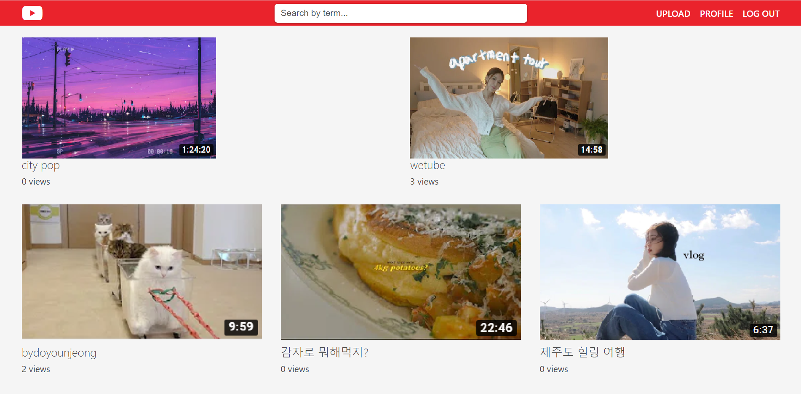

<!--
*** Thanks for checking out this README Template. If you have a suggestion that would
*** make this better, please fork the repo and create a pull request or simply open
*** an issue with the tag "enhancement".
*** Thanks again! Now go create something AMAZING! :D
-->


<!-- PROJECT SHIELDS -->
<!--
*** I'm using markdown "reference style" links for readability.
*** Reference links are enclosed in brackets [ ] instead of parentheses ( ).
*** See the bottom of this document for the declaration of the reference variables
*** for contributors-url, forks-url, etc. This is an optional, concise syntax you may use.
*** https://www.markdownguide.org/basic-syntax/#reference-style-links
-->

<!-- PROJECT LOGO -->
<br />

<p align="center">
  <a href="https://https://github.com/ooyuo/wetube">
    
  </a>

  <h3 align="center">We-tube</h3>


<!-- TABLE OF CONTENTS -->

## 📚 Table of Contents

* [About the Project](#about-the-project)
  * [Built With](#built-with)
  * [Pages](#Pages)
* [Getting Started](#getting-started)
  * [Prerequisites](#prerequisites)
  * [Installation](#installation)
* [Contributing](#contributing)
* [License](#license)
* [Contact](#contact)


<!-- ABOUT THE PROJECT -->

## 🧐 About The Project



Cloning Youtube with Vanilla and NodeJS


### Built With

* [MongoDB](https://www.mongodb.com/)
* [NodeJS](https://nodejs.org/en/)
* [AWS](https://aws.amazon.com/)
* [Heroku](https://www.heroku.com/)
* [SaSS](https://sass-lang.com/)
* [WebPack](https://webpack.js.org/)
* [Pug](https://pugjs.org/)


### Pages

- [x] Home
- [x] Join
- [x] Login
- [x] Search
- [x] User Detail
- [x] Change Password
- [x] Upload
- [x] Video Detail
- [x] Edit Video


<!-- GETTING STARTED -->

## 😎 Getting Started

### Prerequisites

* npm

```sh
npm install
```

```sh
npm run dev:server
```

### Installation

1. Clone the repo

```sh
git clone https://github.com/ooyuo/wetube.git
```

2. Install NPM packages

```sh
npm install
```


<!-- CONTRIBUTING -->

## 🚀 Contributing


1. Fork the Project
2. Create your Feature Branch (`git checkout -b feature/AmazingFeature`)
3. Commit your Changes (`git commit -m 'Add some AmazingFeature'`)
4. Push to the Branch (`git push origin feature/AmazingFeature`)
5. Open a Pull Request


<!-- LICENSE -->

## 👻 License

Distributed under the MIT License. See `LICENSE` for more information.


<!-- CONTACT -->

## 🐱‍🏍 Contact

doyounjeong: doyounjeong0@gmail.com

Project Link: [https://github.com/ooyuo/wetube](https://github.com/ooyuo/wetube)


<!-- MARKDOWN LINKS & IMAGES -->
<!-- https://www.markdownguide.org/basic-syntax/#reference-style-links -->

[linkedin-url]: https://linkedin.com/in/othneildrew

